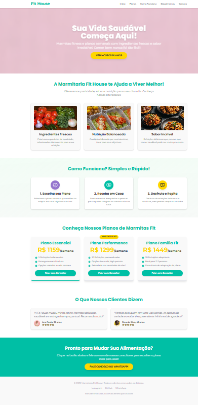

# 🥗 Marmitaria Fit House



> Bem-vindo ao repositório da Marmitaria Fit House! Este é um website moderno e responsivo, focado em apresentar os planos de refeições saudáveis e facilitar o contato direto com os clientes via WhatsApp. Uma solução ideal para negócios de alimentação fitness e delivery.

---

## 🎯 Objetivo do Projeto

Este projeto serve como um **modelo pronto para comercialização (demo)** de landing pages e websites personalizados para negócios no setor de alimentação saudável. Ele foi desenvolvido para ser usado como:
* Item de **portfólio** de um desenvolvedor.
* **Vitrine** de serviços para potenciais clientes.
* **Base** para a criação e entrega de websites reais.

---

## ✨ Destaques e Funcionalidades

* **Design Vibrante e Atractivo:** Paleta de cores moderna e estimulante (Teal, Amarelo Dourado e Roxo Lavanda) que transmite frescor, energia e um estilo de vida saudável.
* **Estrutura Completa de Informações:** Seções dedicadas a apresentar a proposta de valor, como o serviço funciona, os planos de refeições e depoimentos de clientes.
* **Chamadas para Ação (CTAs) Estratégicas:** Botões claros e visíveis que direcionam o usuário para o contato via WhatsApp, otimizando a conversão.
* **Responsividade Total:** O layout se adapta perfeitamente a qualquer dispositivo (desktops, tablets e smartphones), garantindo uma excelente experiência de usuário.
* **Animações e Efeitos Sutis:** Transições e efeitos de hover nos elementos interativos que adicionam dinamismo e profissionalismo ao site.
* **Integração Direta com WhatsApp:** Facilita a comunicação e o processo de pedido ou consulta de informações.

---

## 🛠️ Tecnologias Utilizadas

* **HTML5:** Estrutura semântica e acessível do conteúdo.
* **Tailwind CSS (via CDN):** Framework CSS utilitário para estilização rápida, responsiva e altamente personalizável. As cores da marca são definidas e reutilizadas via variáveis CSS.
* **Google Fonts:**
    * **Poppins:** Utilizada para títulos, conferindo impacto e modernidade.
    * **Montserrat:** Aplicada ao corpo do texto, garantindo legibilidade e um visual clean.
* **Imagens de Alta Qualidade:** Utilização de imagens livres de direitos autorais (Pexels) para um apelo visual profissional.

---

## 🚀 Como Visualizar o Projeto

---

### ✅ Versão ao vivo (GitHub Pages)

👉 [**Ainda não disponível** - Este projeto não está hospedado no GitHub Pages neste momento, mas é ideal para demonstração online.]

* *Dica: Você pode facilmente configurar o GitHub Pages para este repositório!*

---

### 🧪 Testar localmente

1.  **Clone o repositório:**
    ```bash
    git clone [https://github.com/Kaique-Rocha/marmitaria-fit-house-demo](https://github.com/Kaique-Rocha/marmitaria-fit-house-demo)
    ```
2.  **Navegue até o diretório do projeto:**
    ```bash
    cd marmitaria-fit-house-demo
    ```
3.  **Certifique-se da estrutura de pastas para imagens:**
    Para que as imagens sejam carregadas corretamente, organize-as na seguinte estrutura dentro do seu diretório `marmitaria-fit-house-demo`:

    ```
    marmitaria-fit-house-demo/
    ├── index.html
    └── src/
        └── img/
            ├── hero-image.jpeg
            ├── ingredientes.jpg
            ├── nutricao_balanceada.jpg
            ├── sabor_incrivel.png
            ├── ana_paula.webp
            └── ricardo.webp
    ```
    *Obs: As imagens usadas são ilustrativas para a demo. Para um cliente real, as suas próprias fotos profissionais farão toda a diferença!*

4.  **Abra o arquivo `index.html`** em seu navegador web preferido (clicando duas vezes no arquivo ou arrastando-o para a janela do navegador).

---

## 🧩 Personalização e Configuração

Este template é flexível e pode ser rapidamente adaptado.

---

### 💰 Alterar Preços dos Planos

No arquivo `index.html`, localize os `<p>` tags com as classes de preço dentro da seção `id="planos"`:
```html
<p class="text-5xl font-extrabold text-accent mb-6">R$ 159<span class="text-2xl text-neutral-dark">/semana</span></p>
Você pode facilmente ajustar os valores e a unidade (ex: "/dia", "/mês") conforme a oferta do cliente.

---

📲 Onde alterar o número do WhatsApp
Em TODOS os links de WhatsApp (<a> tags com href="https://wa.me/..."), você deve substituir o placeholder +5511995481647 pelo número do cliente real, incluindo o código do país e o DDD.

Exemplo:

HTML

<a href="[https://wa.me/SEU_NUMERO_COMPLETO_AQUI?text=Olá](https://wa.me/SEU_NUMERO_COMPLETO_AQUI?text=Olá)! Gostaria de saber mais sobre o Plano Essencial da Marmitaria Fit House." target="_blank" class="bg-primary ...">Falar com Consultor</a>

---

🖼️ Alterar Imagens
Atualize as URLs das imagens (src nas tags ) para as fotos específicas do seu cliente. A seção Estrutura de Pastas acima detalha onde colocá-las.

---

✏️ Alterar Textos
Modifique os títulos, descrições e depoimentos em todas as seções para refletir a identidade e a proposta de valor do negócio do seu cliente.

---

📦 Estrutura de Pastas
marmitaria-fit-house-demo/
├── index.html
└── src/
    └── img/
        ├── hero-image.jpeg
        ├── ingredientes.jpg
        ├── nutricao_balanceada.jpg
        ├── sabor_incrivel.png
        ├── ana_paula.webp
        ├── ricardo.webp
        └── ... outras imagens relevantes
index.html: O arquivo principal do site.

src/img/: Contém todas as imagens utilizadas no projeto.

---

📣 Quer um site como este para o seu negócio?
Este é um exemplo da qualidade e eficiência que posso trazer para o seu projeto online. Se você ou seu cliente precisam de uma landing page moderna, responsiva e otimizada para conversão, entre em contato!

📧 kaiquerocha1805@gmail.com
📱 WhatsApp: Clique para conversar
🌐 GitHub: github.com/Kaique-Rocha

---

🪪 Licença
Este projeto é um demo comercial. Sua finalidade é estritamente demonstrativa e de portfólio. Para uso em produção, comercialização ou personalização para clientes, é necessário entrar em contato com o autor para discussão de termos e desenvolvimento profissional.

---

👨‍💻 Autor
Desenvolvido com 💻 e 💪 (saúde!) por [Kaique Rocha]
